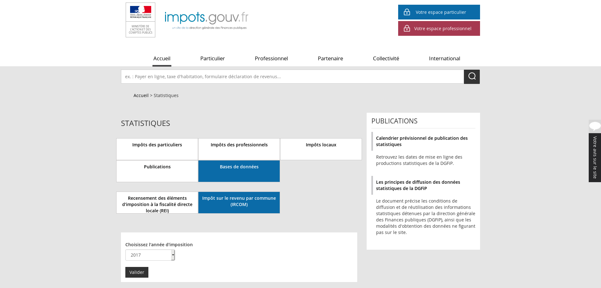
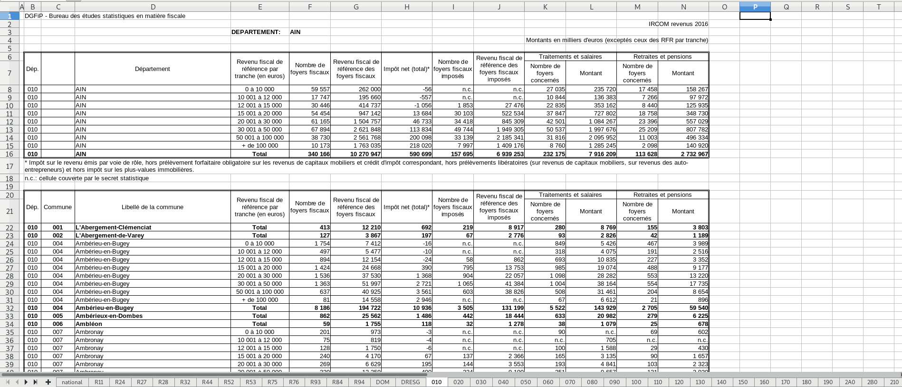
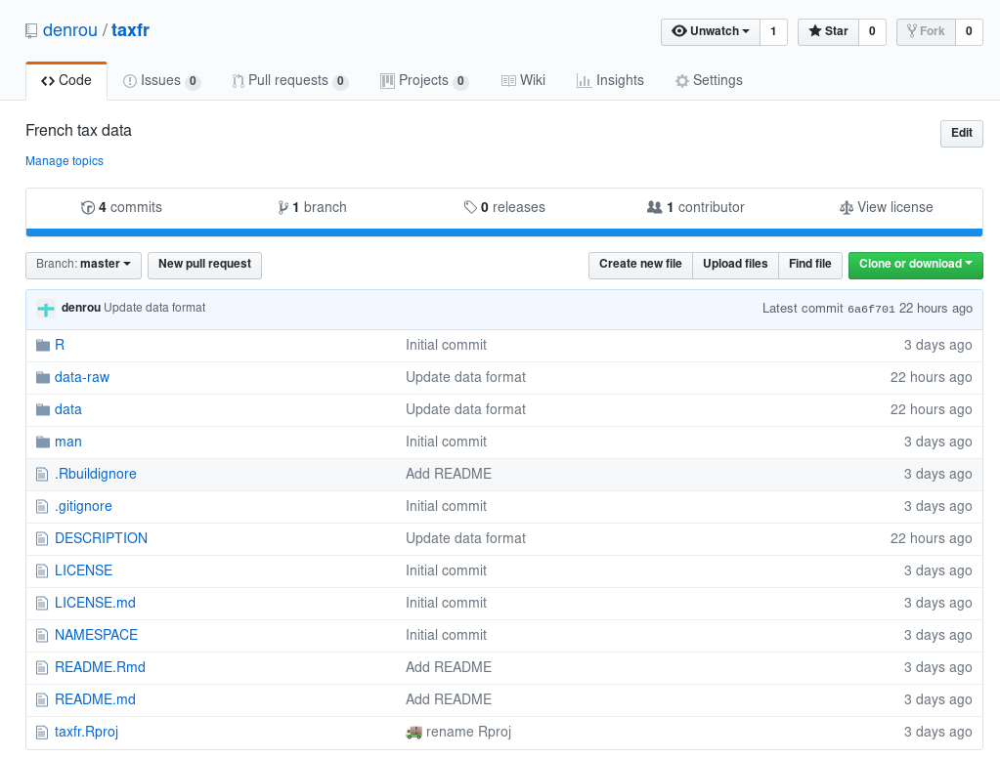
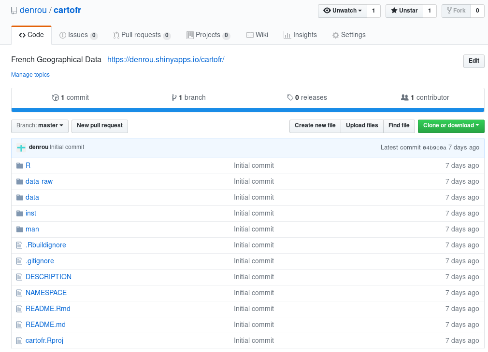
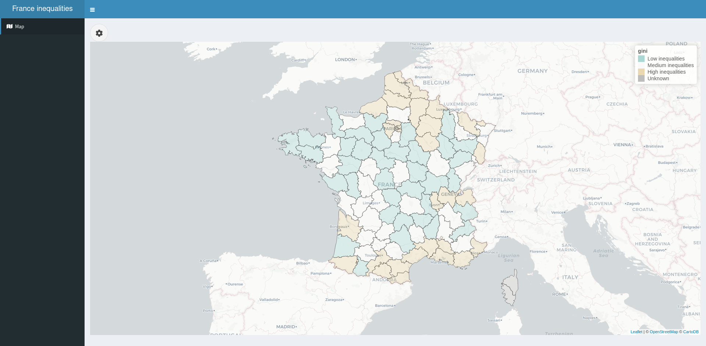

```{r setup, include=FALSE}
options(htmltools.dir.version = FALSE)
library(cartofr)
library(dplyr)
library(ggplot2)
library(glue)
library(hrbrthemes)
library(janitor)
library(kableExtra)
library(purrr)
library(taxfr)
library(scales)
library(sf)
library(stringr)
library(tidyr)

data(tax)
```

class: center, middle

# What does a data scientist do?

---
# Annswering questions based on data

--

Different scenarios:

--
- A client comes to you with a bunch of data and asks you to get some insights from it


--
- A client comes to you and ask you to retrieve some metrics, then you ask him for some data you'll need


--
- You find some good data / tools that could be of a good use for your work / client


--
- You're curious about something and want to explore more

---
# Sometimes in 2018...

.center[]

---
# ... there are interesting data!



---
class: center, middle

# Can we show inequality disparities in France based on tax collected data?

---
background-image: url(https://media.giphy.com/media/beFkBnV3fElDG/giphy.gif)
<!-- background-position: 50% 50% -->
class: center, bottom, inverse

---
class: center, middle

# Let's import some data!

---
# Easy peasy, 10 lines of codes

```{r, eval=FALSE}
dowload_and_extract <- function(file) {
  url      <- glue("https://www.impots.gouv.fr/portail/www2/fichiers/statistiques/base_de_donnees/ircom/{file}")
  destfile <- tempfile(fileext = ".zip")
  download.file(url, destfile)
  unzip(destfile, exdir = "data-raw")
  file.remove(destfile)
  readxl::read_excel(glue::glue("{file}.xlsx"))
}

year_tax    <- 2011:2017
year_revenu <- 2010:2016
files       <- glue("ircom_{year_tax}_revenus_{year_revenu}")
purrr::map_dfr(files, dowload_and_extract)
```

---
# Not so fast!

--
+ For years 2011 to 2015, filenames are in the form `ircom_XXXX_revenusXXXX`, then `ircom_XXXX_revenus_XXXX`


--
+ For years 2011 to 2016, files are in an `xls` format and failed to be imported with `readxl::read_excel`, then `xlsx`


--
+ For years 2011 to 2014, NAs are indicated with `n.c.`, then `n.d.`


--
+ For years 2011 to 2015, only department data are present, then national and regional data are added


--
+ For years 2011 to 2015, taxes are given in euros, then in thousands of euros


---
class: center, middle

# Where to store our data?

---
# Make data packages

--
.pull-left[
### taxfr
[](https://github.com/denrou/taxfr/)
]

--
.pull-right[
### cartofr
[](https://github.com/denrou/cartofr/)
]

---
class: center, middle

# Before answering question, make sure our data are trustworthy.

---
# Glimpse at the data

```{r, eval=FALSE}
tax %>% 
  filter(municipality == "Craponne", year == 2011) %>% 
  select(municipality, postal_code, reference_tax_revenue_per_tranche_in_euros, tax_income, revenue_of_households, number_of_households)
```


```{r, echo=FALSE}
tax %>% 
  filter(municipality == "Craponne", year == 2011) %>% 
  select(municipality, postal_code, reference_tax_revenue_per_tranche_in_euros, tax_income, revenue_of_households, number_of_households) %>%
  mutate_if(is.numeric, format, big.mark = ",") %>% 
  kable(col.names = c("Municipality", "INSEE code", "Reference tax revenue", "Tax income", "Revenues", "Number of people")) %>% 
  kable_styling() %>%
  scroll_box(width = "100%", height = "400px")
```

---
# Number of towns with a reference tax revenue

```{r, echo=FALSE}
tax %>% 
  filter(!is.na(postal_code)) %>% 
  mutate(total = reference_tax_revenue_per_tranche_in_euros == "Total") %>% 
  group_by(year, postal_code) %>% 
  summarise(not_total = sum(!total), total = sum(total)) %>% 
  summarise(not_total = sum(not_total > 0), total = sum(total > 0), prop = not_total / total) %>% 
  mutate_at("year", as.character) %>% 
  mutate_at("prop", percent) %>% 
  mutate_if(is.numeric, format, big.mark = ",") %>% 
  kable(col.names = c("Year", "Towns with reference tax revenue", "Number of distinct towns", "Proportion")) %>% 
  kable_styling()
```

---
# Homogeneity of postal codes

```{r, echo=FALSE, cache=TRUE}
n     <- length(unique(tax$year))
years <- unique(tax$year)

df <- tax %>% 
  filter(!is.na(postal_code)) %>% 
  distinct(year, postal_code) %>% 
  group_by(year) %>% 
  mutate(n_tot = length(postal_code)) %>% 
  group_by(postal_code) %>% 
  filter(n() < n) %>% 
  arrange(postal_code) %>% 
  summarise(add = if_else(min(year) != min(tax$year), min(year), min(tax$year) - 1),
         remove = if_else(max(year) != max(tax$year), max(year) + 1, max(tax$year) + 1),
         missing = toString(sort(setdiff((remove-1):(add), year))))

dff <- df %>% 
  select(-missing) %>% 
  gather(group, year, add, remove) %>% 
  filter(year >= min(tax$year), year <= max(tax$year)) %>% 
  group_by(group, year) %>% 
  summarise(n = n(), insee = stringr::str_trunc(toString(postal_code), 13, ellipsis = glue::glue(" ... + {n() - 2} others"), replace = FALSE)) %>% 
  ungroup() %>% 
  mutate(color = if_else(group == "remove", "red", "green"),
         n = if_else(group == "remove", -n, n),
         n = sprintf("<p align=\"center\", style=\"color:%s\">%+4d</p> <p align=\"center\", style=\"font-size:10px\">(%s)</p>", color, n, insee)) %>%
  select(-color, -insee) %>% 
  spread(group, n)
  

tibble(year = min(tax$year):max(tax$year)) %>% 
  left_join(dff, by = c("year" = "year")) %>% 
  rename(new_insee = add, removed_insee = remove) %>% 
  left_join({
    tax %>% 
      filter(!is.na(postal_code)) %>% 
      distinct(postal_code, year) %>% 
      count(year) %>% 
      mutate(n = format(n, big.mark = ","))
  }, by = "year") %>% 
  rename(distinct_towns = n) %>% 
  select(year, distinct_towns, new_insee, removed_insee) %>% 
  replace_na(list(new_insee = "<p align=\"center\">/<p>", removed_insee = "<p align=\"center\">/<p>")) %>% 
  kable(col.names = c("", "Distinct towns", "New towns", "Towns removed"), escape = FALSE) %>% 
  kable_styling() %>%
  scroll_box(width = "100%", height = "400px")
```

---
# Homogeneity of postal codes

+ Particular case : 

```{r, eval=FALSE}
tax %>% 
  distinct(year, postal_code) %>% 
  group_by(postal_code) %>% 
  mutate(range = max(year) - min(year)) %>% 
  filter(n() < range) %>% 
  summarise(years = toString(year))
```


```{r, echo=FALSE}
tax %>% 
  distinct(year, postal_code) %>% 
  group_by(postal_code) %>% 
  mutate(range = max(year) - min(year)) %>% 
  filter(n() < range) %>% 
  summarise(years = toString(year)) %>% 
  kable(col.names = c("INSEE code", "Years with data")) %>% 
  kable_styling()
```

---
# Data quality

--
+ Homogeneity of geographical information accross years


--
+ Totals correspond to sum of individual categories


--
+ Totals of municipality correspond to total of departments


--
+ Count missing values

--
Some usefull packages for data quality : `janitor`, `naniar`

---
class: center, middle

# How to show inequalities ?

---
# Lorenz curve

```{r, echo=FALSE, fig.align="center", fig.width=12}
bind_rows(
  tibble(pop = 0, rev = 0),
  tax %>% 
    filter(municipality == "Craponne", year == 2017, reference_tax_revenue_per_tranche_in_euros != "Total") %>% 
    select(reference_tax_revenue_per_tranche_in_euros, number_of_households, revenue_of_households, tax_income) %>% 
    mutate(pop = cumsum(number_of_households / sum(number_of_households)), rev = cumsum((revenue_of_households - tax_income) / sum((revenue_of_households - tax_income)))) %>% 
    select(pop, rev)
) %>% 
  ggplot(aes(pop, rev)) + 
  # geom_smooth(formula = y ~ x, se = FALSE) + 
  geom_line() +
  geom_point() +
  geom_segment(x = 0, y = 0, xend = 1, yend = 1) +
  scale_x_continuous(labels = percent) +
  scale_y_continuous(labels = percent) +
  labs(x = "Cumulated proportion of the population", y = "Cumulative proportion of the revenue", title = "Lorenz curve", subtitle = "Municipality of Craponne in 2017") +
  theme_ipsum(grid_col = "gray")
```

---
# Lorenz curve

```{r, echo=FALSE, fig.align="center", fig.width=12}
df <- bind_rows(
  tibble(pop = 0, rev = 0),
  tax %>% 
    filter(municipality == "Craponne", year == 2017, reference_tax_revenue_per_tranche_in_euros != "Total") %>% 
    select(reference_tax_revenue_per_tranche_in_euros, number_of_households, revenue_of_households, tax_income) %>% 
    mutate(pop = cumsum(number_of_households / sum(number_of_households)), rev = cumsum((revenue_of_households - tax_income) / sum((revenue_of_households - tax_income)))) %>% 
    select(pop, rev)
)
df %>% 
  ggplot(aes(pop, rev)) + 
  geom_line() +
  geom_point() +
  geom_segment(x = 0, y = 0, xend = 1, yend = 1) +
  geom_segment(y = 0, x = 0.76, yend = 0.5, xend = 0.76, linetype = 2) +
  geom_segment(y = 0.5, x = 0, yend = 0.5, xend = 0.76, linetype = 2) +
  geom_label(x = 0.76/2, y = 0.5, label = "50% of the wealth", vjust = -0.5) +
  geom_label(x = 0.76, y = 0.25, label = "is owned by 72% of the population", hjust = -0.1) +
  geom_polygon(fill = "#8dd3c7", alpha = 0.3) +
  scale_x_continuous(labels = percent) +
  scale_y_continuous(labels = percent) +
  labs(x = "Cumulated proportion of the population", y = "Cumulative proportion of the revenue", title = "Lorenz curve", subtitle = "Municipality of Craponne in 2017") +
  theme_ipsum(grid_col = "gray")
```

---
# Gini coefficient

Measures of inequality:

$$G = 1 - \sum\limits_{k = 0}^{n - 1}(X_{k+1} - X_{k})(Y_{k+1} + Y_{k})$$

+ `X`: Cumulated share of the population
+ `Y`: Cumulated share of the revenue

```{r, eval=FALSE}
gini <- function(pop, rev) {
  1 - sum(map_dbl(seq_along(pop)[-1], function(i) {(pop[i] - pop[i - 1]) * (rev[i] + rev[i - 1])}))
}
```


---
# Gini coefficient in France

```{r, cache=TRUE, echo=FALSE, fig.align="center", fig.width=12}
df <- tax %>% 
  filter(!is.na(postal_code), !is.na(municipality), reference_tax_revenue_per_tranche_in_euros != "Total") %>%
  group_by(year, postal_code, municipality) %>% 
  filter(any(is.na(revenue_of_households)), any(is.na(number_of_households)), any(is.na(tax_income))) %>% 
  group_by(year, reference_tax_revenue_per_tranche_in_euros) %>% 
  summarise_at(c("revenue_of_households", "number_of_households", "tax_income"), sum, na.rm = TRUE) %>% 
  summarise("Tax data" = gini(number_of_households, revenue_of_households - tax_income)) %>% 
  gather(group, gini, -year) %>% 
  bind_rows(tibble(year = 2011:2015, group = "INSEE", gini = c(0.306, 0.302, 0.288, 0.289, 0.292)),
            tibble(year = 2011:2015, group = "World bank", gini = c(0.333, 0.331, 0.325, 0.323, 0.327)))
df %>% 
  ggplot(aes(year, gini, color = group)) +
  geom_line(size = 1.2) +
  geom_point() +
  geom_text(aes(label = round(gini, 2)), vjust = -1) +
  geom_text(data = summarise(group_by(df, group), year = last(year), gini = last(gini)), aes(label = group), hjust = -0.5) +
  scale_color_brewer(type = "qual", guide = "none") +
  scale_x_continuous(expand = c(0, 1)) +
  labs(x = NULL, y = "Gini coefficient", title = "Comparison of Gini coefficient from multiple sources") +
  theme_ipsum()
```

---
background-image: url(https://media.giphy.com/media/3o7qDSOvfaCO9b3MlO/giphy.gif)
<!-- background-position: 50% 50% -->
class: center, bottom, inverse

---
class: center, middle

# Time to draw some maps now!

---
# Disparity of Gini coefficient in France

.center[]

---
# Conclusion

--
+ What does a data scientist do? He answers a question and often ask more...


--
+ Importing data is not always straightforward


--
+ Data quality control is a necessity and usually takes most of the time


--
+ A data scientist needs to communicate with non technical people, shiny application are great tools to do that


--
+ Making packages helps a lot

---
class: center, middle

# Thank you!
